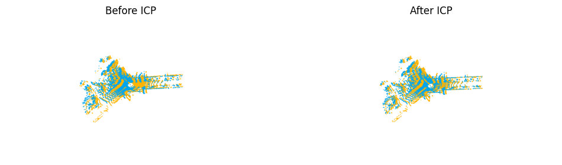
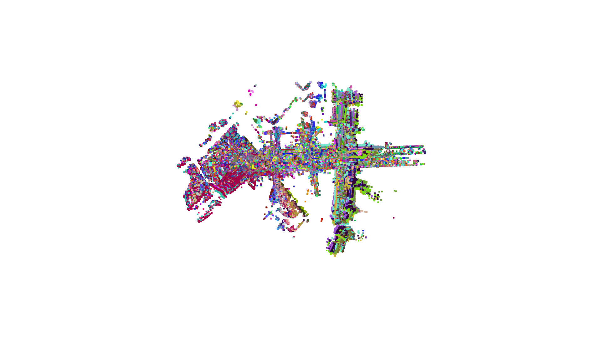
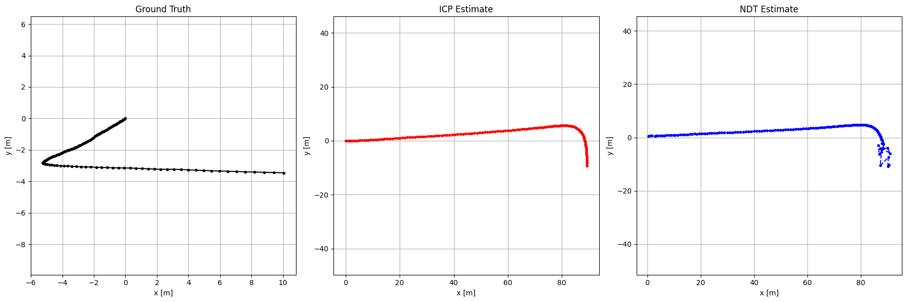
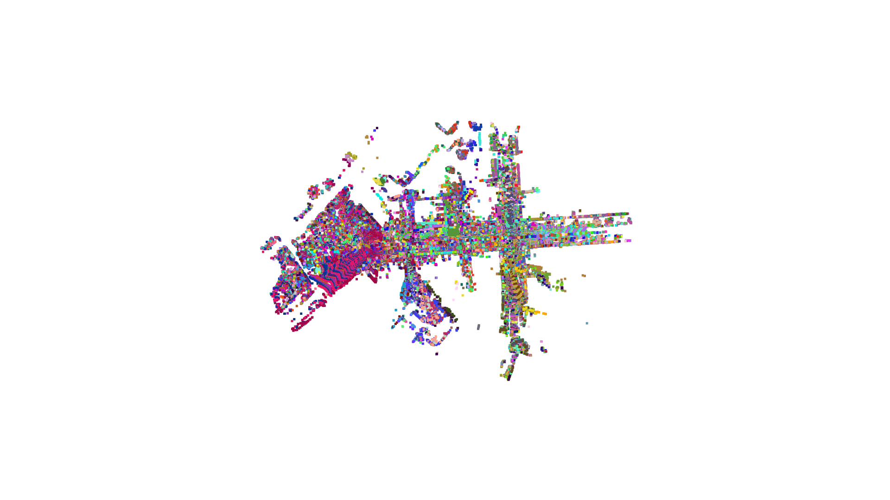

# Vision3D Registration - Iterative Closest Point (ICP) & Normal Distributions Transform (NDT)

**A compact toolkit for 3D LiDAR scan alignment on KITTI data using both ICP and NDT**



---

## 🚀 Project Overview

This repository demonstrates two industry‑standard methods for point‑cloud registration:

1. **Iterative Closest Point (ICP)** – leveraging Open3D’s built‑in algorithms for point‑to‑point alignment
2. **Normal Distributions Transform (NDT)** – using point-cloud-registration library

I noticed a lack of well‑documented, Python‑native NDT documentation. By sharing this code, I aim to accelerate research and application of NDT in the Python ecosystem.

---

## 📂 Repository Structure

```text
├─ kitti_sample/                   # Sample KITTI sequence (frames & ground truth)
│  ├─ 00/                          # Raw .bin LiDAR scans
│  ├─ gt_pose_00.txt               # Ground‑truth trajectory (3×4 matrices)
│  └─ readme.txt                   # KITTI sequence description

├─ ICP.py                          # Open3D‑based ICP wrapper
├─ NDT.py                          # point_cloud_registration NDT alignment
├─ ICP_on_kittiDataset.py          # Driver script: running ICP over KITTI frames
├─ NDT_on_kittiDataset.py          # Driver script: running NDT over KITTI frames
├─ utilities.py                    # .bin → Open3D point‑cloud loader
├─ step_by_step_workflow.ipynb     # Notebook: visualizations, metrics, comparisons
└─ requirements.txt                # Python package dependencies
```

---

## 🔧 Installation

1. **Clone the repository**

   ```bash
   git clone https://github.com/Delavari-Alireza/Python-Toolkit-for-3D-LiDAR-Registration-ICP-NDT
   ```

2. **Install dependencies**

   ```bash
   pip install -r requirements.txt
   ```

---

## ⚙️ Usage

1. **Prepare data**

   * Place your KITTI frames under `kitti_sample/00/` and ensure `gt_pose_00.txt` is present.

2. **Run ICP pipeline**

   ```bash
   python ICP_on_kittiDataset.py
   ```

   * Outputs: `icp_poses.npy`, `icp_pcd.ply` (aligned map)

3. **Run NDT pipeline**

   ```bash
   python NDT_on_kittiDataset.py
   ```

   * Outputs: `ndt_poses.npy`, `ndt_pcd.ply` (aligned map)

4. **Analyze in Jupyter**

   ```bash
   jupyter lab step_by_step_workflow.ipynb
   ```

   * Compare trajectories, compute ADE/FDE, visualize point clouds.

---

## 📈 Results Highlights

* **Trajectories**: Side‑by‑side 2D plots of ICP vs. NDT vs. ground truth
 
* **Errors**: Final & average displacement error metrics for both methods
* **3D Maps**: Fused LiDAR scans showing map consistency and alignment quality
ICP:

NDT:

---

## 💡 Key Contributions

* **Pythonic NDT**: A lightweight, well‐documented NDT implementation to bridge a gap in the Python ecosystem
* **Modular Design**: Separate wrappers and drivers make swapping registration methods trivial
* **Reproducibility**: Fixed seeds, clear instructions, and a sample KITTI sequence for immediate experimentation


---

Feel free to open an issue or submit a pull request!
